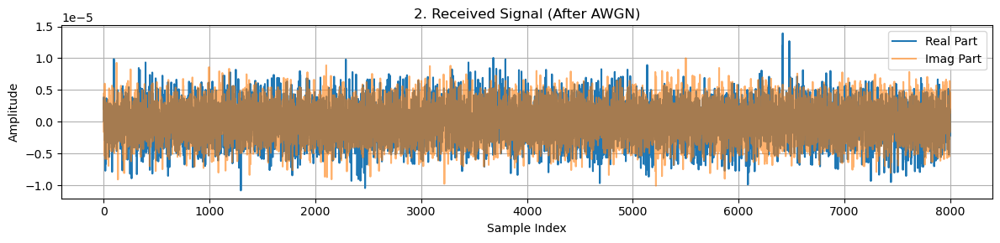
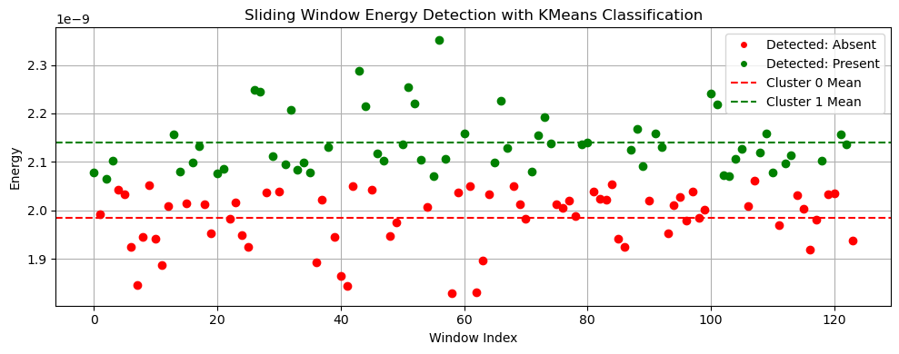

# 📡 Clustering-Based Spectrum Sensing with OFDM Modulation for Cognitive Radio Networks

**Author**: \[Harsh Raj]

---

## 🚀 Motivation

The exponential growth of wireless devices has led to increasing spectrum scarcity. **Cognitive Radio Networks (CRNs)** provide a dynamic solution by allowing **secondary users** to access underutilized frequency bands.
This project explores how **unsupervised machine learning**—specifically **clustering (KMeans)**—can enhance **OFDM-based spectrum sensing**, making it more adaptive and robust.

---

## 🕰️ Historical Context

Traditional spectrum sensing techniques such as:

* 🔋 **Energy Detection**
* 🔍 **Matched Filtering**
* ♻️ **Cyclostationary Detection**

have limitations under **noise uncertainty** and **unknown signal conditions**.

> 📈 **Clustering**, an unsupervised learning approach, bypasses the need for fixed thresholds, making it suitable for dynamic environments—aligning with the growing use of AI in wireless communications.

---

## 🧠 Key Learnings & Contributions

* Built a **complete OFDM transmitter and receiver** using **custom FFT/IFFT**
* Implemented **KMeans-based clustering** for threshold-free signal detection
* Visualized **signal energy**, **clustering output**, and **performance metrics**
* Evaluated system using:

  * ✅ **ROC Curve**
  * ❌ **Bit Error Rate (BER)**

---

## 🎮 FFT & IFFT Algorithm Explanation

Here’s a clear and intuitive explanation of FFT and IFFT, crucial to OFDM systems:

[](https://www.youtube.com/watch?v=h7apO7q16V0)

---

## 📡 OFDM System Overview

Below is the simplified **transmitter-receiver chain** of an OFDM system:


> 📚 **Reference:** [Transmitter and Receiver architecture of OFDM (ResearchGate)](https://www.researchgate.net/figure/Transmitter-and-Receiver-architecture-of-OFDM_fig2_325283793)

---

## 🧪 Project Features

| Feature                | Description                                |
| ---------------------- | ------------------------------------------ |
| OFDM Modulation        | Custom IFFT/FFT for symbol modulation      |
| Channel Model          | AWGN (Additive White Gaussian Noise)       |
| Energy Detection       | Sliding window-based signal power analysis |
| Clustering Algorithm   | KMeans (Unsupervised, adaptive detection)  |
| Performance Evaluation | ROC Curve, BER, and visual diagnostics     |

---

## 💻 Code / Notebook

🔗 Access the full code in [`main.ipynb`](main.ipynb)

<summary>📊 Sample Output: Energy & Clustering</summary>

### 🎵 Modulated Signal


### 📣 Received Signal



### ⚡ Energy per Sliding Window


### 📊 Energy and Clustering Visualization



### 📈 ROC Curve


---

## 📈 Performance Metrics

* **ROC Analysis** for comparing detection performance
* **BER (Bit Error Rate)** to assess overall system reliability
* **Visualization** of clustered signals vs. noise windows

---

## 📦 Requirements

```bash
pip install numpy matplotlib scikit-learn
```

---

## 📝 How to Run

1. Clone this repository:

   ```bash
   git clone https://github.com/your-repo/cognitive-radio-clustering.git
   cd cognitive-radio-clustering
   ```

2. Open and run `main.ipynb` using **Jupyter Notebook** or **JupyterLab**.

3. Explore:

   * 📊 ROC curve visualization
   * 📈 Cluster vs. energy plots
   * 📉 BER performance over SNR range

---

## 🤖 Future Work

* Integrate **real-time SDR hardware** (e.g., USRP or RTL-SDR)
* Explore **deep learning-based classifiers**
* Apply in **non-stationary and mobile environments**
* Optimize clustering with **adaptive windowing**

---

## 📬 Contact

For questions or collaboration opportunities, feel free to reach out:
📧 **[harsh.raj@iitg.ac.in](mailto:harsh.raj@iitg.ac.in)**

---

## ⭐ Support

If you found this project helpful, please consider giving it a **⭐ star** on GitHub!

---
